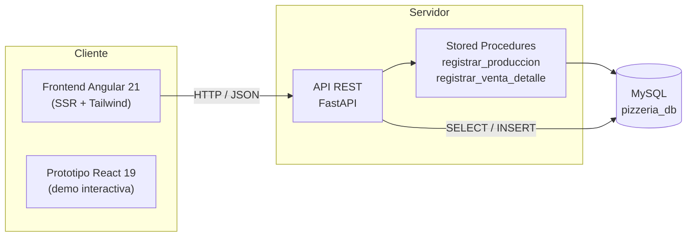

# 🍕 Pizzeria Gestión BOM

Sistema de gestión integral para pizzerías basado en **lista de materiales (BOM — _Bill of Materials_)**. Cada venta o producción descuenta automáticamente las materias primas del inventario siguiendo la receta del producto, manteniendo el stock siempre sincronizado en tiempo real.

El sistema cubre todo el ciclo operativo de un local: control de stock, producción de cocina, compras, punto de venta, plano de mesas con cuentas abiertas, control de turnos y reportes de gestión.


---

## Tabla de contenidos

- [Características](#características)
- [Arquitectura](#arquitectura)
- [Stack tecnológico](#stack-tecnológico)
- [Estructura del proyecto](#estructura-del-proyecto)
- [Modelo de datos y lógica BOM](#modelo-de-datos-y-lógica-bom)
- [API REST](#api-rest)
- [Requisitos previos](#requisitos-previos)
- [Puesta en marcha](#puesta-en-marcha)
- [Variables de entorno](#variables-de-entorno)
- [Notas y roadmap](#notas-y-roadmap)
- [Autor](#autor)

---

## Características

- **Dashboard de Stock** — Visión consolidada del inventario completo con polling automático cada 10 segundos y alertas de stock por debajo del mínimo.
- **Producción de Cocina (To-Do)** — Lista de artículos semielaborados (ej. prepizzas, salsas) bajo el stock mínimo. Al registrar la producción, se suma el stock fabricado y se descuentan automáticamente todos los ingredientes según la receta.
- **Panel de Compras** — Materias primas con alertas de reposición y datos de proveedor (email de contacto por insumo) para gestionar las compras.
- **Punto de Venta (POS)** — Carga de pedidos de platos finales con modalidad `take_away` o `delivery`. Cada venta descuenta el BOM completo del plato de forma transaccional.
- **Plano de Mesas** — Editor de layout del salón, estado en vivo de las mesas y manejo de **cuentas abiertas** por mesa (abrir, agregar ítems, cerrar/cobrar).
- **Control de Turnos** — Apertura y cierre de turno de caja.
- **Reportes de Gestión** — KPIs por turno (volumen de ventas, total facturado, ticket promedio, plato estrella, ocupación de mesas) y desglose por modalidad de venta.

---

## Arquitectura

El sistema sigue una arquitectura desacoplada de tres capas. La lógica crítica de descuento de inventario reside en **procedimientos almacenados de MySQL**, garantizando que toda operación que afecta el stock sea atómica (transaccional).



> La comunicación entre el frontend Angular y el backend se realiza vía HTTP. En el entorno de desarrollo se utiliza un túnel **ngrok** para exponer el backend local; las peticiones incluyen la cabecera `ngrok-skip-browser-warning`.

---

## Stack tecnológico

| Capa | Tecnologías |
|------|-------------|
| **Backend** | FastAPI · Pydantic · `mysql-connector-python` (con pool de conexiones) · CORS |
| **Base de datos** | MySQL 8 (InnoDB) · Procedimientos almacenados |
| **Frontend (producción)** | Angular 21 · Angular SSR (Express) · RxJS · TailwindCSS 3 · `lucide-angular` |
| **Prototipo / Demo** | React 19 · Vite 6 · TailwindCSS 4 · `lucide-react` · `motion` |

---

## Estructura del proyecto

```
.
├── backend_fastapi/
│   └── main.py                 # API FastAPI: endpoints e invocación de SPs
├── database.sql                # Esquema MySQL + datos semilla + procedimientos
│
├── frontend/                   # Aplicación Angular 21 (cliente de producción)
│   └── src/app/
│       ├── components/
│       │   ├── dashboard-stock/     # Inventario consolidado + alertas
│       │   ├── produccion-cocina/   # To-Do de cocina (semielaborados)
│       │   ├── panel-compras/       # Materias primas y reposición
│       │   ├── punto-venta/         # POS (take_away / delivery)
│       │   ├── plano-mesas/         # Layout y estado de mesas
│       │   ├── turno-control/       # Apertura / cierre de turno
│       │   └── reportes/            # KPIs y reportes de gestión
│       └── services/
│           ├── articulo.service.ts  # Inventario, producción, ventas
│           ├── mesa.service.ts      # Mesas y cuentas abiertas
│           ├── turno.service.ts     # Turnos
│           └── reporte.service.ts   # Reportes
│
├── src/                        # Prototipo interactivo en React + Vite
│   ├── App.tsx                 # Demo BOM autocontenida con visor de código
│   └── main.tsx
├── index.html
├── package.json                # Dependencias del prototipo React
└── vite.config.ts
```

> El proyecto incluye **dos frontends**: la app **Angular** (`/frontend`) es el cliente de producción que se conecta al backend real; la app **React** (`/src`) es un prototipo interactivo que demuestra el concepto BOM con datos de ejemplo e incluye un visor del código de referencia.

---

## Modelo de datos y lógica BOM

La base de datos `pizzeria_db` modela los artículos en tres tipos, articulados mediante la tabla de recetas (`receta`), que es el corazón del BOM.

| Tabla | Descripción |
|-------|-------------|
| `articulo` | Catálogo de ítems. Campo `tipo`: `MATERIA_PRIMA`, `SEMI_ELABORADO` o `PLATO_FINAL`. Incluye `stock_actual`, `stock_minimo`, `precio_venta` y `email_proveedor`. |
| `receta` | Define el BOM: relaciona un producto con sus ingredientes y la cantidad de cada uno (`producto_id`, `ingrediente_id`, `cantidad`). |
| `produccion_log` | Registro histórico de producciones de cocina. |
| `venta` | Cabecera de cada venta (fecha y total). |
| `venta_detalle` | Líneas de cada venta (plato y cantidad). |

### Jerarquía de artículos

```
MATERIA_PRIMA   (Harina, Muzzarella, Salsa…)
      │  se transforma en
      ▼
SEMI_ELABORADO  (Prepizza, Salsa preparada…)
      │  se combina en
      ▼
PLATO_FINAL     (Pizza de Muzzarella, Napolitana…)
```

### Procedimientos almacenados

Toda mutación de stock es **transaccional** (con `ROLLBACK` ante error):

- **`registrar_produccion(semi_id, cantidad)`** — Registra la producción, suma el stock del semielaborado fabricado y descuenta del inventario todos sus ingredientes según la receta.
- **`registrar_venta_detalle(venta_id, plato_id, cantidad)`** — Inserta el detalle de venta y descuenta de una sola operación todos los ingredientes del plato vendido.

Esto garantiza que el inventario nunca quede en un estado inconsistente, incluso bajo operaciones concurrentes.

---

## API REST

Base URL: `/api` (servida por FastAPI; en desarrollo, detrás del túnel ngrok).

### Inventario y catálogo
| Método | Endpoint | Descripción |
|--------|----------|-------------|
| `GET` | `/articulos/cocina` | Semielaborados con `stock_actual < stock_minimo` (To-Do de cocina) |
| `GET` | `/articulos/materia_prima` | Materias primas (panel de compras) |
| `GET` | `/articulos/plato_final` | Platos finales (punto de venta) |
| `GET` | `/dashboard/inventario` | Inventario completo |

### Operaciones
| Método | Endpoint | Descripción |
|--------|----------|-------------|
| `POST` | `/produccion` | Registra producción (invoca `registrar_produccion`) |
| `POST` | `/compras` | Registra compra/reposición de materia prima |
| `POST` | `/ventas` | Registra venta con su detalle (`take_away` / `delivery`) |

### Mesas y cuentas
| Método | Endpoint | Descripción |
|--------|----------|-------------|
| `GET` | `/mesas` | Layout de mesas |
| `POST` | `/mesas/guardar-layout` | Guarda la disposición de mesas |
| `GET` | `/mesas/estado-vivo` | Estado en vivo de las mesas |
| `POST` | `/mesas/{mesaId}/cuenta` | Abre una cuenta para una mesa |
| `GET` | `/cuentas/abiertas` | Cuentas actualmente abiertas |
| `GET` | `/cuentas/{ventaId}` | Detalle de una cuenta |
| `POST` | `/cuentas/{ventaId}/items` | Agrega ítems a una cuenta |
| `POST` | `/cuentas/{ventaId}/cerrar` | Cierra/cobra la cuenta |

### Turnos y reportes
| Método | Endpoint | Descripción |
|--------|----------|-------------|
| `GET` | `/turnos/actual` | Turno activo |
| `POST` | `/turnos/abrir` · `/turnos/cerrar` | Apertura / cierre de turno |
| `GET` | `/reportes/resumen-actual` | Resumen operativo en vivo |
| `GET` | `/reportes/turnos?desde=&hasta=` | KPIs por turno |
| `GET` | `/reportes/modalidades?desde=&hasta=` | Ventas por modalidad |

### Historial
| Método | Endpoint | Descripción |
|--------|----------|-------------|
| `GET` | `/dashboard/historial-produccion` | Histórico de producciones |
| `GET` | `/dashboard/historial-ventas` | Histórico de ventas |

---

## Requisitos previos

- **Python** 3.10+
- **MySQL** 8.x
- **Node.js** 20+ y **npm** 10+
- **Angular CLI** 21 (`npm install -g @angular/cli`)
- _(Opcional para desarrollo)_ **ngrok**, para exponer el backend local

---

## Puesta en marcha

### 1. Base de datos

```bash
mysql -u root -p < database.sql
```

Esto crea la base `pizzeria_db`, las tablas, los procedimientos almacenados y carga el catálogo inicial de artículos y recetas.

### 2. Backend (FastAPI)

```bash
cd backend_fastapi

# Crear entorno virtual e instalar dependencias
python -m venv venv
source venv/bin/activate          # en Windows: venv\Scripts\activate
pip install fastapi uvicorn "mysql-connector-python" pydantic

# Levantar el servidor (puerto 8000)
uvicorn main:app --reload --host 0.0.0.0 --port 8000
```

Documentación interactiva disponible en `http://localhost:8000/docs`.

### 3. Frontend (Angular — cliente de producción)

```bash
cd frontend
npm install

# Ajustar la apiUrl en los services antes de arrancar (ver más abajo)
npm start                          # ng serve → http://localhost:4200
```

Para compilar con renderizado del lado del servidor (SSR):

```bash
npm run build
npm run serve:ssr:frontend
```

### 4. Prototipo (React — opcional)

```bash
npm install
npm run dev                        # http://localhost:3000
```

---

## Variables de entorno

### Backend

El backend lee la configuración de la base de datos desde variables de entorno (con valores por defecto):

| Variable | Por defecto | Descripción |
|----------|-------------|-------------|
| `DB_HOST` | `localhost` | Host de MySQL |
| `DB_USER` | `root` | Usuario |
| `DB_PASSWORD` | _(vacío)_ | Contraseña |
| `DB_NAME` | `pizzeria_db` | Base de datos |

### Frontend (Angular)

La URL del backend está definida en cada servicio (`articulo.service.ts`, `mesa.service.ts`, `turno.service.ts`, `reporte.service.ts`) mediante la propiedad `apiUrl`. Actualizá ese valor según tu entorno:

```ts
// Desarrollo local
private apiUrl = 'http://localhost:8000/api';

// Túnel ngrok (las peticiones ya incluyen la cabecera ngrok-skip-browser-warning)
private apiUrl = 'https://<tu-subdominio>.ngrok-free.dev/api';
```

> 💡 Considerá centralizar `apiUrl` en los `environment.ts` de Angular para no repetirla en cada servicio.

---

## Notas y roadmap

- **Seguridad** — El backend de referencia usa `allow_origins=["*"]` en CORS; restringilo a tus dominios en producción. La gestión de credenciales debe migrarse a variables de entorno seguras / gestor de secretos.
- **Túnel de desarrollo** — La URL de ngrok es temporal; recordá actualizarla en los servicios cada vez que cambie.
- **Mejoras sugeridas** — Autenticación y roles de usuario, centralización de `apiUrl` por entorno, migraciones versionadas de la base de datos y suite de tests automatizados (Vitest ya está disponible en el frontend).

---

## Autor

Proyecto **Pizzeria Gestión BOM** — Sistema de gestión de inventario por lista de materiales para pizzerías, con producción de cocina, punto de venta y dashboard.
